---

### 👋 About

I'm a CS student at the **Paul G. Allen School, UW Seattle** who likes problems that don't fit in one box — from real-time finance tools to computer-vision apps that run right in the browser. I build across the whole stack and care about things that actually ship and actually run.

📍 Seattle, WA · 🎓 Class of 2023 · 🌐 [abhirams.dev](https://abhirams.dev/) · 🤝 Open to internships & collabs

---

### 🛠️ Things I've Built

| Project | What it does |
|---|---|
| ⚡ **Optera** | Real-time options pricing — Black-Scholes engine with interactive charts |
| 👟 **SoleTrack** | Sneaker collection tracker with cross-market pricing & alerts |
| 🏠 **DormScape** | 3D dorm planner with furniture layout and budgeting |
| 🧥 **Outfit** | AI wardrobe stylist that builds outfits from photos of your closet |
| 🤟 **Signa** | In-browser American Sign Language recognition over webcam |
| 🎵 **VibeSound** | Mood-to-music translator that generates playlists from emotions |

More at **[abhirams.dev](https://abhirams.dev/)** →

---

### 🧰 Stack I Reach For

**Build**

**ML / Backend**

**Data / Infra**

---

### 📊 GitHub

  
  
  

---

### 🤝 Connect

  
  
  

